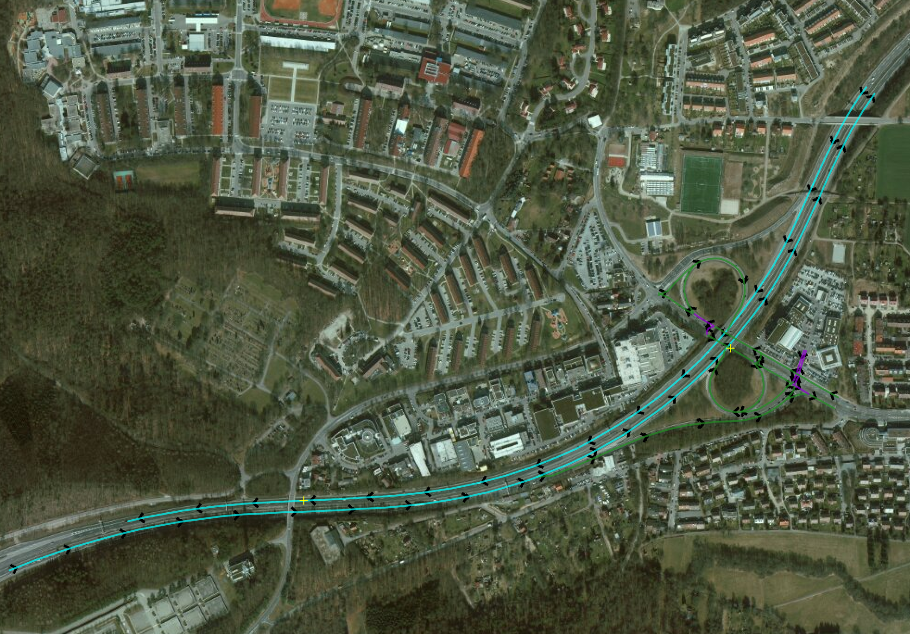
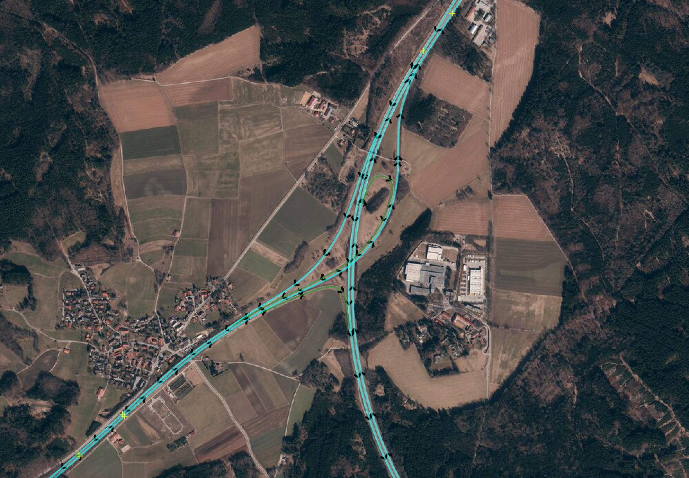
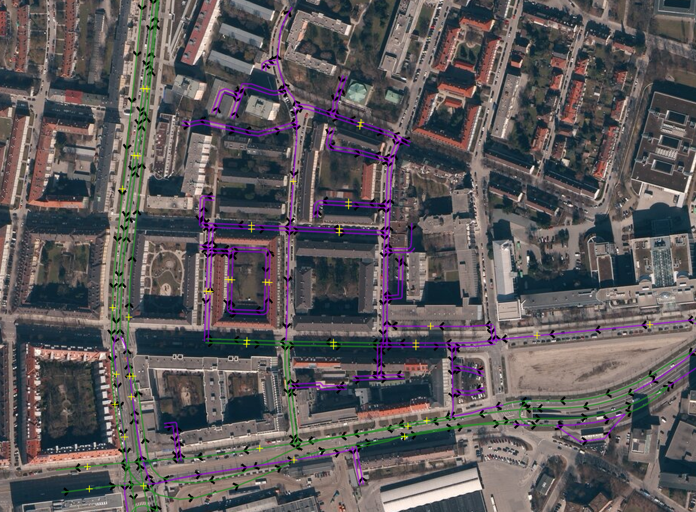
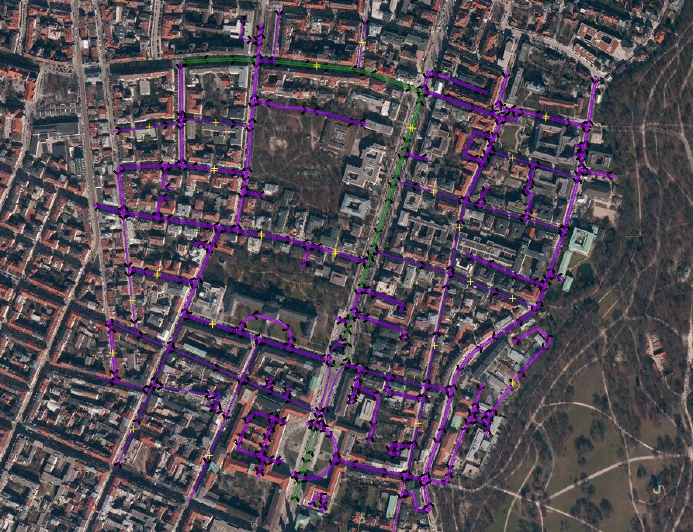

# Vehicle routing with higher order penalties

This repository contains the thesis and a [Jupyter notebook](thesis.ipynb) showcasing its results.

### Abstract

> Autonomous driving has become a trendy topic in both academia and industry. Many ADAS systems rely on high-definition maps for navigation and localization. The creation process of HD maps is complex and often involves recording **large road networks**. Atlatec GmbH uses a proprietary navigation system called AtlaRoute to create optimized routes for the company’s fleet of recording vehicles.
> 
> This thesis is dedicated to the problem of optimizing routes for driver comfort by punishing **inharmonious maneuvers**, such as premature highway exits. The problem frequently occurs when routes are optimized exclusively for duration or distance with standard Travelling Salesperson Problem solvers.
> 
> The work proposes two approaches to solve the problem: **adding lane-level topology** information to the routing graph to restrict unnecessary lane changes and optimizing routes with higher-order penalties using a **higher-order graph representation** of the road network, which we call the **X-Graph**. The latter approach is novel in the field of navigation and shows promising results.

### Scenarios
The notebook has examples of different routing problem scenarios:
- Stuttgart
- Highway
- Urban
- Mixed

👨‍🎓**Egor Spirin**, _Technical University of Munich, 2022_
